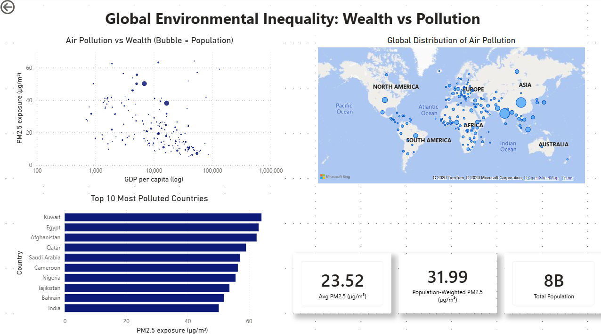

# 🌍 Global Environmental Inequality

Data analytics project exploring the relationship between PM2.5 air pollution, socioeconomic inequality, and population exposure using Python, SQL, and Power BI

## 📊 Interactive Dashboard



## 📌 Overview

This project investigates how air pollution exposure differs across countries with varying income levels and population density. The analysis highlights environmental inequality patterns and demonstrates how data analytics can support evidence-based decision-making.

## 📊 Executive Summary

### Key Findings
- Countries with lower GDP per capita generally showed higher exposure to PM2.5 pollution.
- Densely populated lower-income regions experienced disproportionately high environmental risk.
- Significant regional disparities were identified between developed and developing economies.
- Pollution exposure patterns revealed strong correlations with socioeconomic inequality indicators.

### Why It Matters
The findings demonstrate how environmental and socioeconomic data can be combined to better understand public health and inequality challenges.

## 🛠️ Tools & Technologies
- Python
- Pandas
- NumPy
- SQL
- Power BI
- Matplotlib / Seaborn
- Jupyter Notebook

## 🗂️ Dataset

The project combines publicly available datasets containing:
- PM2.5 pollution levels
- GDP per capita
- Population statistics
- Regional environmental indicators

## ⚙️ Project Workflow

1. Data collection and cleaning
2. Data preprocessing and normalization
3. Exploratory data analysis
4. Correlation analysis
5. Dashboard development
6. Insight generation and visualization

## 🔍 Key Insights

### Income vs Pollution
Lower-income regions generally experienced higher pollution exposure levels.

### Population Density
Urbanized regions showed significantly increased PM2.5 concentration.

### Regional Disparities
Developing economies demonstrated stronger environmental inequality patterns compared to developed regions.

## 💡 Recommendations

- Improve environmental monitoring in vulnerable regions.
- Prioritize pollution reduction initiatives in densely populated areas.
- Combine environmental and socioeconomic data in public policy planning.

## 🧠 Skills Demonstrated

- Data cleaning and preprocessing
- Exploratory data analysis
- SQL querying
- Data visualization
- Dashboard development
- Analytical storytelling
  
## ✅ Conclusion

This project demonstrates how data analytics can uncover relationships between environmental and socioeconomic inequality while supporting data-driven decision-making through visualization and exploratory analysis.

## 📁 Project Structure
````
global-enviro-project/
│
├── data/
│ ├── raw/
│ └── processed/
│
├── notebooks/
│ └── 01_data_cleaning.ipynb
│
├── images/
│ └── dashboard.png
│
└── README.md
````
## 👩‍💻 Author

Kristýna Slámová  
Aspiring Data Analyst

- [LinkedIn](https://linkedin.com/in/kristýna-slámová)
- [GitHub](https://github.com/slamova-labs)
